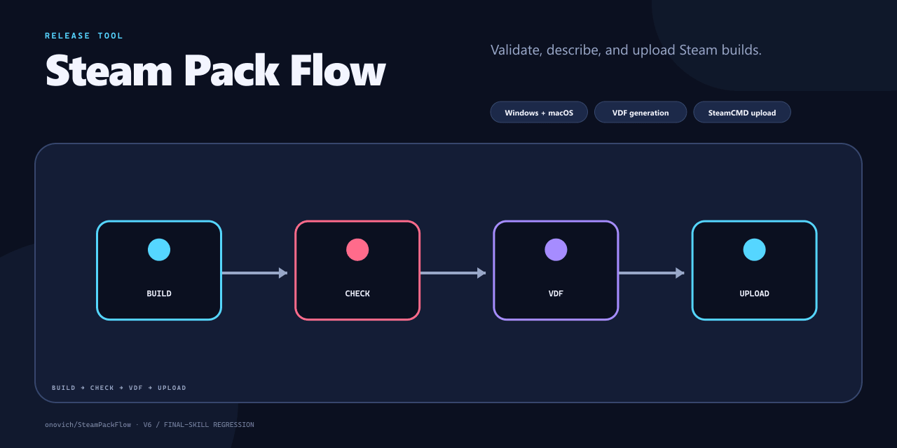

# SteamPackFlow

[English](README.md)

跨 Windows/macOS 的 SteamCMD 打包上传流程，负责校验包名、生成 VDF 和上传构建。



## 项目包含什么

- 支持 Windows 与 macOS。
- 生成 VDF。
- 通过 SteamCMD 上传。

## 快速开始

直接双击下面列出的启动文件即可，无需在终端中输入命令。

### 首次安装

用途：在新电脑上将 SteamCMD 安装到对应平台的 `builder` 目录；SteamCMD 缺失或损坏时也可用它恢复。通常只需操作一次。

- macOS：双击 `Mac/InstallSteamCMD.command`。
- Windows：双击 `Win/InstallSteamCMD.bat`。

发布启动器检测到 SteamCMD 缺失时会自动安装，因此首次发布前单独安装是可选步骤。

### 配置游戏

编辑 `Win/config/games.json` 或 `Mac/config/games.json`，在 `games` 下添加游戏：

```json
{
  "games": {
    "MyGame": {
      "full": { "entryNames": { "Win": "MyGame.exe", "Mac": "MyGame.app" }, "appleTeamId": "APPLE_TEAM_ID", "appId": "APP_ID", "depots": { "Win": "WIN_DEPOT_ID", "Mac": "MAC_DEPOT_ID" } },
      "demo": { "entryNames": { "Win": "MyGame.exe", "Mac": "MyGame.app" }, "appleTeamId": "APPLE_TEAM_ID", "appId": "DEMO_APP_ID", "depots": { "Win": "DEMO_WIN_DEPOT_ID", "Mac": "DEMO_MAC_DEPOT_ID" } }
    }
  }
}
```

`entryNames` 是 Steam 启动用的 `.exe`/`.app`，AppID 和 DepotID 从 Steamworks 获取。
`appleTeamId` 是用于核对 Mac 签名团队的 10 位 Apple Developer Team ID，属于公开标识，
不是密码。游戏键只能使用字母和数字，并且必须与 ZIP 文件名一致：
`Win_MyGame_1.2.3_Demo.zip` 使用 `demo`，不带 `_Demo` 时使用 `full`。`steamCmdPath` 通常
无需修改；`setLive` 留空表示只上传、不自动上线。不要在配置中保存 Steam 用户名、密码或 API Key。

### 发布使用

用途：扫描对应平台的 `inbox`，校验并整理构建包、生成 VDF，然后通过 SteamCMD 上传。每次需要发布新构建时操作。

把游戏 ZIP 放入任一平台的 `inbox`，然后根据你能读懂的语言双击启动文件：

压缩 ZIP 时，所有文件都要放在 ZIP 的一级目录里。不要把这些文件上层的文件夹一起打包，否则会多出一层冗余目录。

- macOS 中文：`Mac/UploadSteamBuild.zh-CN.command`
- macOS 英文：`Mac/UploadSteamBuild.en-US.command`
- Windows 中文：`Win/UploadSteamBuild.zh-CN.bat`
- Windows 英文：`Win/UploadSteamBuild.en-US.bat`

对于已签名的 Mac App，配置中的 `.app` 名和内部可执行文件名必须在构建时就正确。

### CI 接入

自动化流程应显式传入 Windows 包路径和 Steam 用户名，并启用 `-NonInteractive`。同时启用
`-StrictArtifact`，让 CI 在入口名称不符或 ZIP 多套一层目录时直接失败，而不是自动修复包。
部署流程还可以锁定预期的游戏、平台、版本类型、AppID 和 DepotID，并强制 `setLive` 为空；
任一不符都会在启动 SteamCMD 前终止。首次验证凭据和文件映射时使用 `-Preview`：SteamCMD
只生成清单和日志，不上传内容。`config.vdf` 属于登录凭据，只能从受保护的 Secret 恢复，
不得进入 Git、Artifact 或 Cache。

#### 为什么 Win 电脑移除了 Mac 发布功能

Windows 处理 ZIP 时无法可靠保留 macOS Framework 软链接、Unix 可执行权限和 Apple 签名/公证
数据；签名后的 `.app` 只要内容被改动，签名就会失效。因此 Windows 启动器会拒绝 Mac ZIP。
请保持 Mac ZIP 原样，将其放入 `Mac/inbox`，再使用 macOS 启动器发布。

## 仓库结构

- `Mac/` — macOS 流程。
- `Win/` — Windows 流程。

## 当前状态

仓库已经包含与上述用途对应的实现和项目材料。当前仓库没有自动化测试，评估时请在目标环境中直接运行。

## 许可证

当前仓库未包含开源许可证。
